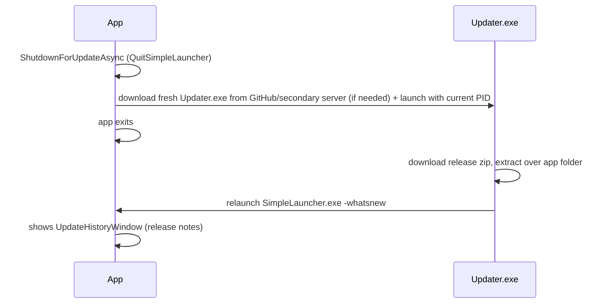

# 16 — Updater

> Update checking, the Updater.exe flow, restart/reinstall.
> Related: [04 — Architecture](04-architecture.md) · [15 — Development](15-development.md)

## Update check (`CheckForUpdatesService`)

`SimpleLauncher\Services\CheckForUpdatesService.cs`

- **Source fallback chain** (app + both updaters): 
  1. GitHub API `https://api.github.com/repos/purelogiccode/SimpleLauncher/releases/latest` (primary repo),
  2. GitHub API `https://api.github.com/repos/purelogiccode/SimpleLauncher/releases/latest` (transferred organization),
  3. Secondary server `assets.purelogiccode.com/Simple Launcher/Simple Launcher/version.txt` (Cloudflare-hosted) — builds the release/updater URLs from it. WPF uses `release_{version}_{rid}.zip` / `updater_{rid}.zip`; Avalonia uses `release_avalonia_{version}_{rid}.zip` / `updater_avalonia_{rid}.zip`.
- **Silent check** at startup (`CheckForUpdatesService.cs`). If every GitHub source is unreachable (offline, rate-limited, blocked), the check falls back to the secondary server.
- **Manual check**: About window "Check for Updates" (`AboutViewModel` → `ManualCheckForUpdatesAsync`).
- Version comparison against the current `5.7.0`; new version → prompts to download.

## Update assets

Both apps read the same GitHub release, so the asset names are prefixed per app (an unprefixed name would collide and each app would download the other app's payload):

- `release_{version}_{rid}.zip` — the new WPF app payload (rid = `win-x64` / `win-arm64`).
- `updater_{rid}.zip` — the standalone `Updater.exe` used when it is not already present.
- `release_avalonia_{version}_{rid}.zip` — the new Avalonia app payload.
- `updater_avalonia_{rid}.zip` — the Avalonia updater (`SimpleLauncher.Avalonia.Updater.exe` + dll/deps/runtimeconfig); it runs with the self-contained runtime shipped in the app folder.

## Update install flow

- `QuitSimpleLauncher` (`Services\QuitOrReinstall\QuitSimpleLauncher.cs`):
  - `RestartApplicationAsync` (`:34`) — spawns itself with `--restarting`, then shuts down; failed restart → "FailedToRestart" box, app stays alive; user-canceled launch (Win32 error 1223) → Information log + "FailedToRestart" box, app stays alive.
  - `SimpleQuitApplication` (`:70`).
  - `ShutdownForUpdateAsync` (`:78`) — downloads fresh `Updater.exe` from GitHub (fallback: secondary server), launches it with the current PID, kills the app.
- `ReinstallSimpleLauncher` (`Services\QuitOrReinstall\ReinstallSimpleLauncher.cs`):
  - `StartUpdaterAndShutdownAsync` (`:33`, async-void) — launches local `Updater.exe` or downloads it from GitHub/secondary server, then hard-exits; access-denied (error 5) → correct message box.
- `--restarting` skips single-instance enforcement during startup (`App.xaml.cs:528`); `-whatsnew` shows the release-notes window (`App.xaml.cs:634-651`).

## `SimpleLauncher.Updater` project

Standalone console app (`Updater.exe`) shipped with each release (`version.txt` = `release5.7.0`). Responsibilities: fetch the latest release (GitHub API primary → transferred-organization repo → secondary server as fallback), download the release zip for the current RID (retrying from the secondary server if the primary download fails), extract over the application folder, relaunch the app. The Avalonia cross-platform updater (`SimpleLauncher.Avalonia.Updater`) uses the same fallback chain with the `release_avalonia_{version}_{rid}.zip` asset name and relaunches `SimpleLauncher.Avalonia(.exe)`.

## Related docs

- [04 — Architecture](04-architecture.md) (startup/shutdown lifecycle)
- [15 — Development](15-development.md) (release packaging)
- [17 — Release Notes](17-release-notes.md)
