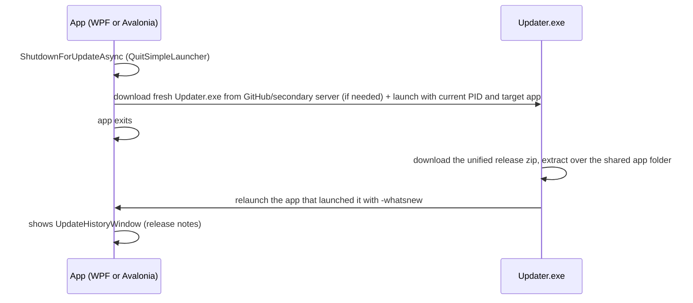

# 16 — Updater

> Update checking, the Updater.exe flow, restart/reinstall.
> Related: [04 — Architecture](04-architecture.md) · [15 — Development](15-development.md)

## Update check (`CheckForUpdatesService`)

`SimpleLauncher\Services\CheckForUpdatesService.cs` (WPF) and
`SimpleLauncher.Avalonia\Services\AvaloniaCheckForUpdatesService.cs` (Avalonia).

- **Source fallback chain** (app + updater):
  1. GitHub API `https://api.github.com/repos/purelogiccode/SimpleLauncher/releases/latest` (primary repo),
  2. Secondary server `assets.purelogiccode.com/Simple Launcher/Simple Launcher/version.txt` (Cloudflare-hosted) — builds the release/updater URLs from it (`release_{version}_{rid}.zip` / `updater_{rid}.zip`).
- **Silent check** at startup. If every GitHub source is unreachable (offline, rate-limited, blocked), the check falls back to the secondary server.
- **Manual check**: About window "Check for Updates".
- Version comparison against the current `5.8.0`; new version → prompts to download.
- **Missing platform assets**: a release is not required to ship every RID — when the latest release has no `release_{version}_{rid}.zip` / `updater_{rid}.zip` for the current platform, the check logs at Information and reports no update (LB-23) instead of an Error (which would also file a bug report).

## Update assets

Both apps read the same GitHub release, which ships the Windows and Linux bundles plus a
standalone updater per RID:

- `release_{version}_{rid}.zip` — the unified payload: `SimpleLauncher.exe` (WPF) and
  `SimpleLauncher.Avalonia.exe` (Avalonia) next to each other plus the shared content files
  (`images/`, `tools/`, `samples/`, `appsettings.json`, …). Both apps are framework-dependent
  single executables (managed assemblies bundled; native libraries such as SQLite/Skia ship
  beside the exe), so the .NET 10 Desktop Runtime is required.
- `updater_{rid}.zip` — the single standalone `Updater.exe` (framework-dependent single file)
  shared by both apps. It bundles the Avalonia native libraries it needs (`libSkiaSharp.dll`,
  `libHarfBuzzSharp.dll`, `av_libglesv2.dll`, `IncludeNativeLibrariesForSelfExtract`) and
  self-extracts them at launch, so the one file runs from either app folder **and** on legacy
  WPF-only installs that never had those natives (which is how the old WPF updater asset name is
  reused for the unified release).
- On Linux (`rid` = `linux-x64` / `linux-arm64`) the same asset names carry the self-contained
  single-file `SimpleLauncher.Avalonia` payload (managed assemblies bundled into the binary;
  native libraries such as Skia/HarfBuzz/SQLite ship beside it, same shape as the Windows exes)
  and the self-contained single-file `Updater`; the ZIP entries
  carry Unix permission bits (0755 for the executables) — see
  [15 — Development](15-development.md#linux-release-packaging-script).

## Update install flow

- `QuitSimpleLauncher` (WPF) / `AvaloniaQuitSimpleLauncher` (Avalonia):
  - `RestartApplicationAsync` — spawns itself with `--restarting`, then shuts down; failed restart → "FailedToRestart" box, app stays alive; user-canceled launch (Win32 error 1223) → Information log + "FailedToRestart" box, app stays alive.
  - `ShutdownForUpdateAsync` — downloads a fresh `Updater.exe` from GitHub (fallback: secondary server), launches it with the current PID and the target executable name, kills the app.
- `ReinstallSimpleLauncher` (WPF) / `ReinstallAndShutdownAsync` (Avalonia):
  - `StartUpdaterAndShutdownAsync` / `LaunchUpdaterAndShutdownAsync` — launches the local `Updater.exe` or downloads it from GitHub/secondary server, then hard-exits; access-denied (error 5) → correct message box.
- `--restarting` skips single-instance enforcement during startup; `-whatsnew` shows the release-notes window.
- The updater relaunches with `-whatsnew` (not `--restarting`), so the restarted app still goes
  through the shared single-instance guard: if another instance is somehow still alive, the
  relaunch exits and restores that instance instead of running two copies.

## `SimpleLauncher.Avalonia.Updater` project

The single updater (`Updater.exe`) shared by both apps. Responsibilities: fetch the latest
release (GitHub API primary → secondary server as fallback), download the unified release zip
for the current RID (retrying from the secondary server if the primary download fails), extract
over the application folder, relaunch the app that launched it. The launching app passes its
PID as the first argument and the target executable name (`SimpleLauncher.exe` or
`SimpleLauncher.Avalonia.exe`) as the second; older WPF releases pass only the PID, so the
updater detects the target from the process name. It was built from the Avalonia codebase
(cross-platform `net10.0` / `net10.0-windows`) and replaced the former WPF-specific updater.
The updater excludes its own files (`Updater*`) during extraction so it can replace the
applications while running. Release-zip extraction is fail-closed against Zip-Slip: every entry
must resolve under the destination root, with a case-sensitive (Ordinal) prefix comparison on
Unix so a case-variant prefix (`/app/` vs `/APP/`) cannot pass. On Unix, a replaced file keeps
its live mode and a file added by the update receives the mode carried by the release zip
(0755 for executables), so newly bundled tools stay executable.

Behavior parity with the dropped WPF updater is intentional: same Serilog setup (rolling warning
file + bug-report sink) and launch stats, same progress/log window with a Cancel button, the same
Dokan detection/install prompt after a successful update, the same retry/secondary-server
fallback, and the same global exception handling — including a UI-thread handler that logs,
reports the bug, shows the error dialog and exits with code 1 instead of vanishing. The app's
project reference uses `ReferenceOutputAssembly=false; Private=false` so the SDK does not copy
the updater's plain build sidecars into the publish output, and the publish step cleans the
updater's staging tree first because `dotnet publish` overwrites but never deletes
(`Remove-UpdaterSidecars` in `scripts/package-release.ps1` remains as a guard).

## Related docs

- [04 — Architecture](04-architecture.md) (startup/shutdown lifecycle)
- [15 — Development](15-development.md) (release packaging)
- [17 — Release Notes](17-release-notes.md)
